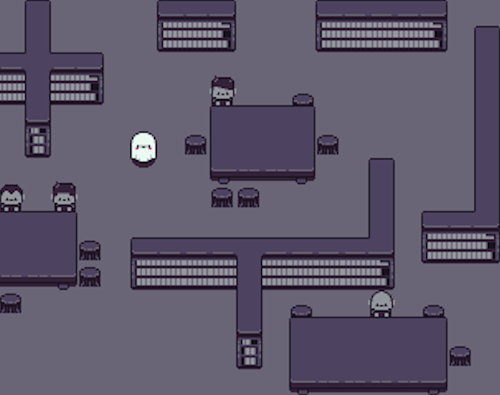

# OctoJam2019

Repository for [SHhhh!](https://alecsis.itch.io/shhhh).

## Game description

SHhhh! is a little game built during the OctoJam-2019 hosted at Epitech (@IndieColle on Twitter), Rennes (France). We were two programmers and one artist (@Kowee11), who worked two days with minimum means (no game engine, only raw c++ and [raylib](https://www.raylib.com/index.html)) to challenge our skills and creativity!

The goal of the game is simple: keep the library quiet as long as possible. Sometimes humans will laugh and make noise, and our little ghost must interact with the environment (E key) in order to scare them. Don't interact too much or you will freak people out and they could leave the library. Have fun!

## Level builder

Levels are built using [Tiled](https://www.mapeditor.org/). A first layer contains all the background sprites, while another one contains the students and the ghost.
The output is directly copied in the source files to avoid having to parse the json.

## Installing

For precompiled binaries, see the [itchio page](https://alecsis.itch.io/shhhh) for the game.

To compile, the only dependency is [raylib](https://www.raylib.com/index.html). Files are unorganized as we used different editors, and used the internal capabilities of our IDEs to sort the source files.

## Credits

Developers:

* <https://github.com/JRock007>
* <https://github.com/Alecsis> / <https://github.com/Alecsis>

Designer :

* <https://twitter.com/Kowee11>

Shaders / Framework by <https://github.com/raysan5/raylib>

